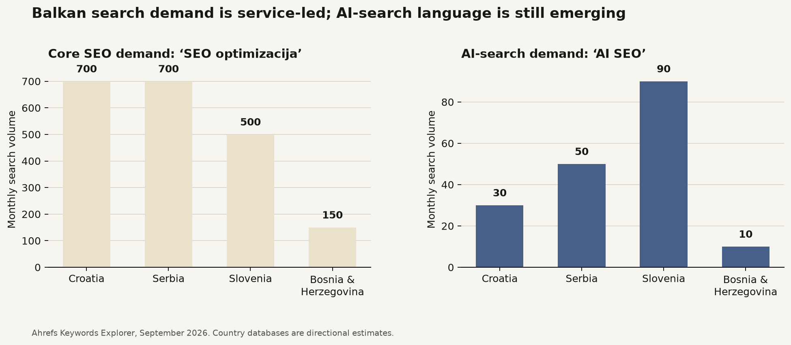
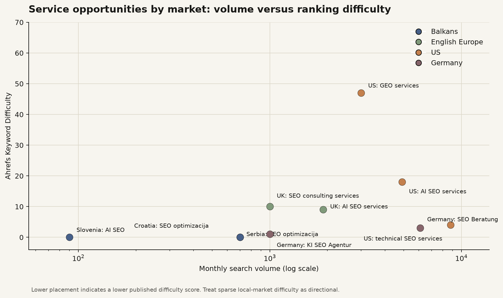
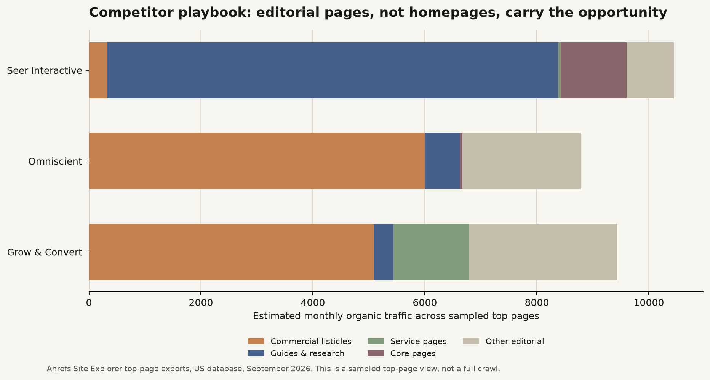

# Koupoli regional keyword and content-gap analysis

**Author:** Manus AI  
**Date:** 26 September 2026  
**Markets:** Croatia and the Balkan region first; English-language Europe and the United States second  
**Data basis:** Ahrefs Keywords Explorer and Site Explorer exports. Search volume, keyword difficulty, and traffic are third-party estimates, not guarantees. Raw exports are archived in [`keyword-gap-data/raw`](keyword-gap-data/raw/).

## Executive conclusion

Koupoli should launch as a **regional specialist with international proof**, rather than as an undifferentiated “organic marketing” agency. The local opportunity is concentrated around Croatian and regional-language searches for SEO optimisation, pricing, agencies, and consultation. Croatia shows **700 monthly searches** for *SEO optimizacija* and **200** for *SEO optimizacija cijena*. Serbia shows the same **700** for *SEO optimizacija*, while Slovenia shows **500**. These are small but commercially meaningful markets where a concise, credible service site can compete.

AI-search language is not yet mature in the region. “AI SEO” registers **30 searches in Croatia**, **50 in Serbia**, **90 in Slovenia**, and **10 in Bosnia and Herzegovina**. English is where this category already has material demand: the US database reports **4,900** searches for *AI SEO services*, **3,000** for *generative engine optimization services*, and **3,500** for *AI search optimization*. The website should therefore use Croatian for local conversion pages and English for internationally useful AI-search and technical authority content. [1]

## The market in one view

The regional numbers support a practical distinction. **Traditional SEO is the conversion language in the Balkans.** AI SEO should be positioned as a modern capability within that offer, not as the sole headline term. Slovenian search demand is large enough to validate a later localized entry, but only once native-language delivery and proof are available. German terms show large demand, but German pages should not be launched without native-language sales and content capability; a translated landing page would not meet the local intent behind those searches.

| Market | Representative keyword | Monthly volume | Difficulty | What it means for Koupoli |
|---|---:|---:|---:|---|
| Croatia | SEO optimizacija | 700 | 0 | Make this the Croatian operational-service cornerstone. |
| Croatia | SEO optimizacija cijena | 200 | 0 | A transparent price-and-scope guide can capture qualified demand. |
| Croatia | SEO savjetovanje | 100 | n/a | A direct fit for the Organic Launch Consultation offer. |
| Serbia | SEO optimizacija | 700 | 0 | Validate regional demand, but avoid duplicate country pages at launch. |
| Slovenia | SEO optimizacija | 500 | 9 | A later localized market with an achievable service-intent opportunity. |
| Slovenia | AI SEO | 90 | n/a | The strongest measured Balkan AI-search signal in this review. |
| Bosnia & Herzegovina | SEO agencija | 150 | 2 | Commercial demand exists, but it is not large enough to justify a separate site section yet. |
| United Kingdom | SEO consulting services | 1,000 | 10 | A viable English-language consulting page target. |
| United Kingdom | AI SEO services | 1,900 | 9 | A strong English operational-service target. |
| United States | Technical SEO services | 8,800 | 4 | Validates the category internationally; do not imply a US physical presence. |
| United States | Generative engine optimization | 7,200 | 65 | A long-term authority topic requiring original evidence. |

> **Positioning implication:** lead with “organic growth through SEO, AI search, and technical execution” in English, and with “SEO optimizacija i SEO savjetovanje” in Croatian. Use **AI SEO**, **AI search visibility**, **generative engine optimization (GEO)**, and **LLM SEO** as supporting entities that explain how the work has evolved.

## Opportunity map

The matrix deliberately separates volume from rankability. It shows why the site needs two tracks. The **Croatia/Balkans track** is small, local, and conversion-led. The **English authority track** is larger and needs educational depth, clear methodology, and first-party examples before it can win competitive international searches.

## Competitor content gap

The current Koupoli site has no content system designed around the new two-offer model. The content gap is not simply “more blog posts.” It is the absence of pages that join high-intent service selection with credible explanations of technical SEO, AI search, and launch planning.

The international leaders sampled here earn visibility with different but complementary patterns. Grow & Convert’s biggest sampled page is a commercial agency comparison page with about **5,085 estimated monthly visits** for “content marketing agency.” Omniscient’s sampled winners are primarily commercial listicles such as B2B content marketing, link-building, and international-SEO agency pages. Seer Interactive combines technical guides with original research, including a GEO explainer and a study on AI brand mentions. Koupoli can borrow the structure, but its differentiation must be the personal, cross-functional perspective and practical delivery rather than generic agency copy. [1]

The pattern is clear: the site should not expect a homepage or two service pages to create enough topical authority. Commercial listicles and practical technical articles expand the keyword surface, while service pages convert the resulting interest.

| Competitor | Winning pattern | Evidence from sampled top pages | Transferable lesson |
|---|---|---|---|
| Grow & Convert | Buyer-intent comparisons plus service pages | “Top content marketing agency” drives 5,085 estimated visits; the content-marketing service page drives 1,354. | Build a useful selection page only when Koupoli can add original criteria and market knowledge. |
| Omniscient | Listicles around category selection | Agency-listicle pages lead the sample, including B2B content marketing at 1,474 and link-building at 1,155. | Comparison content can attract commercial researchers before they choose a provider. |
| Seer Interactive | Technical explainers and original research | “What is GEO?” drives 213; “What drives brand mentions in AI answers” drives 129 and has 273 referring domains. | Original experiments and strong technical explainers can earn links and support service authority. |

## The launch content architecture

### 1. Croatian conversion layer: build first

The Croatian layer should be compact and focused. It exists to turn relevant local demand into conversations, not to build a large blog immediately.

| Priority | Proposed page | Primary target | Supporting entities | Purpose |
|---:|---|---|---|---|
| 1 | `/usluge/seo-optimizacija/` | SEO optimizacija | tehnički SEO, on-page SEO, indeksiranje, brzina web stranice, strukturirani podaci | The operational service page. |
| 2 | `/usluge/seo-savjetovanje/` | SEO savjetovanje | organski rast, analiza tržišta, sadržajna strategija, plan lansiranja | The Organic Launch Consultation offer. |
| 3 | `/usluge/tehnicki-seo/` | Tehnički SEO | crawling, indeksiranje, Core Web Vitals, sitemap, robots.txt, schema markup | A specialist delivery page that supports the operational offer. |
| 4 | `/seo-optimizacija-cijena/` | SEO optimizacija cijena | SEO audit, opseg rada, retainer, jednokratni projekt | A transparent price-and-scope explainer for high-intent enquiries. |
| 5 | `/uvidi/ai-seo/` | AI SEO | AI pretraga, Google AI Overviews, ChatGPT, Perplexity, citati | A short, accurate local explainer that links to services. |

Use one Croatia-first language version at launch. Croatia, Bosnia and Herzegovina, and much of Serbia can understand the same core South Slavic content, but do not create thin country/city doorway pages. Let local case studies, contact details, and a Google Business Profile carry geographic relevance. If Slovenia becomes a commercial priority, invest in a native Slovenian review rather than automatic translation.

### 2. English authority layer: build alongside it

English content should serve Europe and the US without claiming local offices. The intent is to establish Koupoli as a credible advisor and operator on organic launches and search changes.

| Priority | Proposed page | Primary target | Monthly volume / KD | Job to be done |
|---:|---|---|---:|---|
| 1 | `/services/organic-growth-consulting/` | SEO consulting services | 1,000 / 10 (UK) | Explain the strategic launch engagement and its concrete outputs. |
| 2 | `/services/technical-seo-ai-search/` | AI SEO services | 1,900 / 9 (UK) | Define the operational offer: technical SEO, implementation, content planning, and AI-search readiness. |
| 3 | `/insights/ai-search-visibility/` | AI search optimization | 3,500 / 47 (US) | Explain how visibility is measured across Google AI features and answer engines. |
| 4 | `/insights/generative-engine-optimization/` | Generative engine optimization | 7,200 / 65 (US) | Create the definitive evidence-led GEO explainer; this is an authority build, not a quick win. |
| 5 | `/insights/website-migration-seo/` | Website migration SEO | 800 / 5 (US) | Demonstrate technical competence with a useful, narrow playbook. |
| 6 | `/insights/ai-search-visibility-tools/` | AI visibility | 4,400 / 0 (US) | Publish a buyer-oriented evaluation only after testing tools directly and adding original screenshots. |

The English pages should always explain the relationship between the terms. **SEO** remains the durable technical and content foundation. **AI SEO**, **GEO**, and **LLM SEO** describe visibility in AI-generated answers, but none replaces crawlability, indexation, information architecture, accurate entities, or genuinely useful content. Google’s own guidance does not require a special “AI markup” system; it emphasizes the same accessible, helpful, well-structured web content that supports Search broadly. [2] [3]

## The two offers, translated into search language

| Koupoli offer | Buyer-facing name | Search-aligned language | Deliverables to make visible on the page |
|---|---|---|---|
| 1. Advisory | **Organic Launch Consultation** | SEO consulting, SEO strategy, organic growth consulting, SEO savjetovanje | Market and search opportunity map, positioning input, technical risk review, 90-day organic plan, measurement design. |
| 2. Operational | **SEO & AI Search Operations** | Technical SEO services, AI SEO services, SEO optimizacija, technical SEO consultant | Audits, implementation tickets, information architecture, content briefs, schema and indexation work, AI-search monitoring, reporting. |

Do not call the first offer a generic “strategy.” The buyer needs to understand the moment of use: **a launch, a repositioning, a new category, or an organic-growth plan that lacks an owner**. Do not call the second offer merely “SEO.” The delivery page should spell out both the technical work and the content/creative planning that make that work useful.

## Recommended editorial backlog for the first six months

This is a staged authority plan, not a promise to publish at high volume. Each item should have a named author, published date, updated date, original diagrams or screenshots, and clear links to the relevant offer.

| Phase | Asset | Market / language | Primary purpose |
|---|---|---|---|
| Month 1 | Rebuilt home page plus the two offer pages | Croatian + English | Clarify the commercial model and establish conversion paths. |
| Month 1 | SEO optimizacija cijena | Croatian | Capture price-qualified local demand and set scope expectations. |
| Month 2 | What AI SEO means for Croatian businesses | Croatian | Educate without overstating a still-small regional query category. |
| Month 2 | Website migration SEO checklist | English | Earn early authority on a narrow low-difficulty technical topic. |
| Month 3 | AI search visibility: what to measure | English | Own the measurement conversation and produce an original framework. |
| Month 4 | Generative engine optimization: evidence, limits, and a practical workflow | English | Build an authoritative, citation-worthy pillar. |
| Month 5 | How to choose an SEO consultant for an organic launch | English | Capture commercial research and connect directly to advisory. |
| Month 6 | SEO agency vs consultant vs in-house: an organic launch decision guide | English | A comparison asset modeled on leader demand patterns, with original decision criteria. |

## What not to do

Do not optimize the new website around “organic marketing” as its only central keyword. The researched international seed set did not return a meaningful standalone service cluster compared with SEO consulting, technical SEO, and AI-search terms. Use **organic growth** as the brand narrative and the name of the advisory offer. Use the words buyers actually search—*SEO consulting*, *technical SEO services*, *SEO optimizacija*, and *AI SEO services*—in page titles, headings, internal links, and supporting content.

Do not publish German service pages at launch solely because the numbers are appealing. Germany shows **6,100** monthly searches for *SEO Beratung* and **1,000** for *KI SEO Agentur*, but the commercial-local intent means native copy, local trust signals, and real delivery capability matter more than the raw volume. Monitor this market until it is a genuine sales priority.

## Bottom line

The regional launch should be **Croatian-first in conversion and English-first in authority**. The early commercial pages should make the two offers unambiguous: one engagement plans an organic launch; the other carries out technical SEO and AI-search work. The first Croatian content should answer pricing and service-scope questions. The first English content should show differentiated technical judgment, beginning with migration, AI visibility, and a carefully evidenced GEO pillar.

This approach preserves the Koupoli brand position while matching real search behavior: local buyers find familiar SEO language, and international buyers see a modern organic-growth specialist who can explain and implement the transition to AI-mediated search.

## References

[1]: https://app.ahrefs.com "Ahrefs Keywords Explorer and Site Explorer exports, September 2026"
[2]: https://developers.google.com/search/docs/fundamentals/ai-optimization-guide "Google Search Central: AI features and your website"
[3]: https://developers.google.com/search/docs/appearance/ai-features "Google Search Central: AI features and your website"
